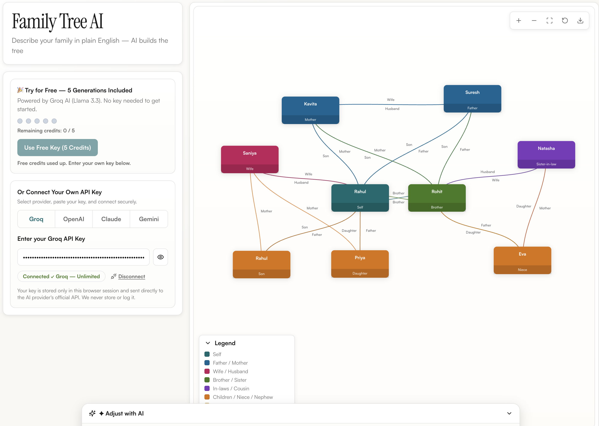

# 🌳 Family Tree AI

<div align="center">


**Describe your family in plain English — and watch it come to life as an interactive tree.**

[✨ Features](#-features) · [📸 Screenshots](#-screenshots) · [🚀 Getting Started](#-getting-started) · [🏗️ Architecture](#️-architecture) · [🤝 Contributing](#-contributing)

</div>

---

## 📖 Overview

**Family Tree AI** is a modern, AI-powered web application that lets you describe your family relationships in natural language and instantly generates a beautifully rendered, interactive family tree. No data entry forms, no complicated drag-and-drop — just type something like:

> *"My grandfather Arjun had two sons: my dad Raj and his brother Dev. Raj married Priya and they have me (Aarav) and my sister Mia."*

...and the AI parses your description, understands the relationships, and renders a live, navigable family tree on screen.

---

## 📸 Screenshots



---

## ✨ Features

### 🤖 AI-Powered Parsing
- Understands natural language descriptions of family relationships
- Powered by **Groq's ultra-fast LLM inference** (llama3/mixtral)
- Handles complex multi-generational families, step-relatives, and non-linear descriptions
- Intelligent error recovery and clarifying suggestions

### 🌲 Interactive Tree Visualization
- **Canvas-based rendering** with smooth pan and zoom
- **Auto-layout engine** that intelligently positions nodes across generations
- **Animated SVG connectors** that dynamically route between parent/child nodes
- Color-coded relationship roles (Self, Parent, Sibling, Child, etc.)
- Responsive tree that fills the full viewport

### 🎨 Premium UI/UX
- Dark-mode-first design with a rich indigo/slate color palette
- Glassmorphism-style card components
- Smooth micro-animations and hover effects
- Serif display typography (`Instrument Serif`) for an elegant look
- Fully responsive layout

### 💬 Conversational Chat Interface
- Persistent chat panel to refine and expand your tree
- Supports follow-up messages: *"Add my cousin Lena on my dad's side"*
- Real-time streaming AI responses
- Differentiated UI for user vs. AI messages

### 📤 Export
- Export your family tree as a high-resolution image (PNG) using `html2canvas`
- One-click download directly from the toolbar

### 🏛️ Clean Architecture (MVVM)
- Clear separation: Models → Services → ViewModels → Components
- Fully typed with TypeScript throughout
- Custom React hooks for zoom/pan, drag, and resize

---

## 🚀 Getting Started

### Prerequisites

- **Node.js** ≥ 18.x
- **npm** ≥ 9.x
- A free **Groq API key** from [console.groq.com](https://console.groq.com)

### Installation

```bash
# 1. Clone the repository
git clone https://github.com/Xdiad47/Family-tree-.git
cd Family-tree-

# 2. Install dependencies
npm install

# 3. Set up environment variables
cp .env.local.example .env.local
```

### Configure your API Key

Open `.env.local` and add your Groq API key:

```env
NEXT_PUBLIC_GROQ_FREE_KEY=your_groq_api_key_here
```

> ⚠️ **Never commit your `.env.local` file.** It is already listed in `.gitignore`.

### Run the Development Server

```bash
npm run dev
```

Open [http://localhost:3000](http://localhost:3000) in your browser.

---

## 🏗️ Architecture

The project follows a clean **MVVM (Model-View-ViewModel)** pattern:

```
family-tree/
├── app/                        # Next.js App Router
│   ├── api/                    # API route handlers (AI proxy)
│   ├── globals.css             # Global styles & design tokens
│   ├── layout.tsx              # Root layout with font setup
│   └── page.tsx                # Entry point
│
├── models/                     # Core domain types
│   └── FamilyNode.ts           # FamilyNode, RelationshipType, TreeBounds
│
├── services/                   # Business logic & external integrations
│   ├── ai/                     # AI prompt engineering & Groq API calls
│   ├── treeLayoutService.ts    # Generation-aware auto-layout algorithm
│   └── exportService.ts        # PNG export via html2canvas
│
├── viewmodels/                 # State management & orchestration
│   ├── useAppViewModel.ts      # Top-level app state coordinator
│   ├── useTreeViewModel.ts     # Tree nodes CRUD, layout triggers
│   ├── useChatViewModel.ts     # Chat history, AI message handling
│   └── useProviderViewModel.ts # AI provider/model selection
│
├── hooks/                      # Reusable UI hooks
│   ├── useZoomPan.ts           # Pinch-to-zoom & pan gesture handling
│   ├── useDrag.ts              # Node dragging on canvas
│   └── useResizeObserver.ts    # Canvas container size tracking
│
├── components/                 # React UI components
│   ├── tree/                   # Tree visualization components
│   │   ├── TreeCanvas.tsx      # Main SVG+HTML canvas renderer
│   │   ├── PersonNode.tsx      # Individual person card node
│   │   ├── ConnectionLayer.tsx # SVG bezier curve connectors
│   │   ├── TreeToolbar.tsx     # Zoom controls & export button
│   │   ├── TreeLegend.tsx      # Relationship color legend
│   │   └── EmptyTreeState.tsx  # Placeholder when no tree exists
│   ├── chat/                   # Chat panel components
│   ├── layout/                 # Page layout shells
│   ├── provider/               # AI provider selector UI
│   └── ui/                     # Shared UI primitives (buttons, inputs)
│
├── constants/                  # App-wide constants
├── utils/                      # Utility functions
├── docs/
│   └── screenshots/            # 📸 App screenshots for README
└── public/                     # Static assets
```

### Data Flow

```
User types description
        ↓
  ChatViewModel sends prompt to Groq AI (via /api route)
        ↓
  AI returns structured JSON (FamilyNode[])
        ↓
  TreeViewModel stores nodes & triggers auto-layout
        ↓
  treeLayoutService positions nodes by generation/row
        ↓
  TreeCanvas renders nodes + ConnectionLayer draws SVG edges
        ↓
  useZoomPan + useDrag enable interactive navigation
```

---

## 🛠️ Tech Stack

| Category | Technology |
|---|---|
| Framework | [Next.js 14](https://nextjs.org/) (App Router) |
| Language | [TypeScript 5.6](https://www.typescriptlang.org/) |
| Styling | [Tailwind CSS 3.4](https://tailwindcss.com/) |
| AI Inference | [Groq API](https://console.groq.com/) (llama3 / mixtral) |
| Export | [html2canvas](https://html2canvas.hertzen.com/) |
| Icons | [Lucide React](https://lucide.dev/) |
| Font | [Instrument Serif](https://fonts.google.com/specimen/Instrument+Serif) (Google Fonts) |

---

## ⚙️ Environment Variables

| Variable | Description | Required |
|---|---|---|
| `NEXT_PUBLIC_GROQ_FREE_KEY` | Your Groq API key from [console.groq.com](https://console.groq.com) | ✅ Yes |

---

## 📜 Scripts

```bash
npm run dev        # Start development server on http://localhost:3000
npm run build      # Build for production
npm run start      # Start production server
npm run typecheck  # Run TypeScript type checking
```

---

## 🤝 Contributing

Contributions are welcome! Here's how to get started:

1. **Fork** the repository
2. **Create** a feature branch: `git checkout -b feature/your-feature-name`
3. **Commit** your changes: `git commit -m 'feat: add some feature'`
4. **Push** to your branch: `git push origin feature/your-feature-name`
5. **Open** a Pull Request

Please ensure your code passes TypeScript checks (`npm run typecheck`) before submitting.

---

## 📄 License

This project is licensed under the **MIT License** — see the [LICENSE](LICENSE) file for details.

---

## 🙏 Acknowledgements

- [Groq](https://groq.com/) for blazing-fast LLM inference
- [Vercel](https://vercel.com/) for Next.js and deployment infrastructure
- [Lucide](https://lucide.dev/) for the beautiful icon set

---

<div align="center">
  Made with ❤️ and AI · <a href="https://github.com/Xdiad47/Family-tree-">Star this repo ⭐</a>
</div>
